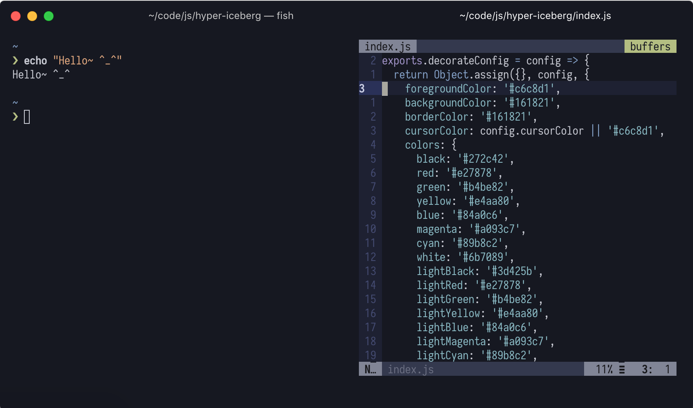

# THIS IS NOW DEPRECATED

[cocopon](https://github.com/cocopon), the original author of the Iceberg theme, has created an *official* port of the theme. You can find it over at [cocopon/hyper-iceberg](https://github.com/cocopon/hyper-iceberg).

Downloading the official version via adding `hyper-iceberg` to your hyper config should also do the job now.
___

# Bringing iceberg to hyper!

This is a port of the wonderful [iceberg](https://github.com/cocopon/iceberg.vim) vim and terminal color scheme by [cocopon](https://github.com/cocopon) for [Hyper](https://hyper.is/)!



This a very basic port right now. No fitting border colors or any other CSS is defined within the package, just the colors.

To install this, add `hyper-iceberg` to your `.hyper.js`'s plugin section, like so:
```
plugins: [
  'hyper-iceberg'
],
```
Lastly, reload/restart Hyper and you should be all set! :)

---

Font used in the screenshot: [Iosevka Term](https://github.com/be5invis/Iosevka)

I personally use [hyperterm-cursor](https://github.com/alvaropinot/hyperterm-cursor) so I can see what's underneath at all times
